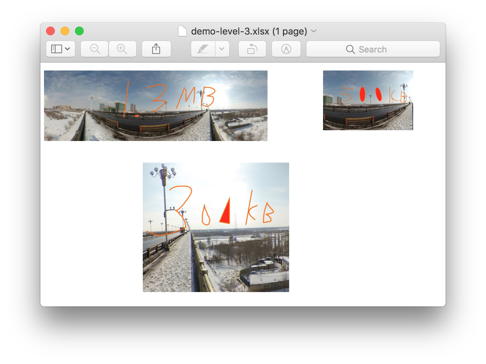

# Compress XLSX Image files

把 Excel 里太大的图片 (文件大小) 通过降低分辨率和尺寸的方式减少尺寸.
所有的图片都会被缩减到 $IMGSIZE 以下.

## 使用方法

```shell
$ source comprezer.sh
$ IMGSIZE=1,000,000; comprezer demo.xlsx output.xlsx
all image files inside demo.xlsx will be compressed so its filesize less than 1000000 bytes
processing xl/media/image3.jpeg... ...done (image reduced by 537606 bytes =  1358165 -   820559)
reduced
    /Users/zxtang/git/compress-excel-images/demo.xlsx ( 2106274 bytes) to
    output.xlsx ( 1543716 bytes) by
     562558 bytes
```

## 例子

```shell
$ IMGSIZE=1,000,000; comprezer demo.xlsx demo-level-1.xlsx
all image files inside demo.xlsx will be compressed so its filesize less than 1000000 bytes
processing xl/media/image3.jpeg... ...done (image reduced by 537606 bytes =  1358165 -   820559)
reduced
    /Users/zxtang/git/compress-excel-images/demo.xlsx ( 2106274 bytes) to
    demo-level-1.xlsx ( 1543716 bytes) by
     562558 bytes

$ IMGSIZE=500,000; comprezer demo.xlsx demo-level-2.xlsx
all image files inside demo.xlsx will be compressed so its filesize less than 500000 bytes
processing xl/media/image1.jpg...done (image reduced by 59071 bytes =   522272 -   463201)
processing xl/media/image3.jpeg... ... ... ...done (image reduced by 987490 bytes =  1358165 -   370675)
reduced
    /Users/zxtang/git/compress-excel-images/demo.xlsx ( 2106274 bytes) to
    demo-level-2.xlsx ( 1050049 bytes) by
     1056225 bytes

$ IMGSIZE=100,000; comprezer demo.xlsx demo-level-3.xlsx
all image files inside demo.xlsx will be compressed so its filesize less than 100000 bytes
processing xl/media/image1.jpg... ... ... ... ...done (image reduced by 427380 bytes =   522272 -    94892)
processing xl/media/image2.jpg... ... ...done (image reduced by 105679 bytes =   182137 -    76458)
processing xl/media/image3.jpeg... ... ... ... ... ... ... ...done (image reduced by 1285978 bytes =  1358165 -    72187)
reduced
    /Users/zxtang/git/compress-excel-images/demo.xlsx ( 2106274 bytes) to
    demo-level-3.xlsx (  285091 bytes) by
     1821183 bytes

$ IMGSIZE=10,000; comprezer demo.xlsx demo-level-4.xlsx
all image files inside demo.xlsx will be compressed so its filesize less than 10000 bytes
processing xl/media/image1.jpg... ... ... ... ... ... ... ... ... ... ...done (image reduced by 513327 bytes =   522272 -     8945)
processing xl/media/image2.jpg... ... ... ... ... ... ... ... ...done (image reduced by 174442 bytes =   182137 -     7695)
processing xl/media/image3.jpeg... ... ... ... ... ... ... ... ... ... ... ... ... ...done (image reduced by 1351017 bytes =  1358165 -     7148)
reduced
    /Users/zxtang/git/compress-excel-images/demo.xlsx ( 2106274 bytes) to
    demo-level-4.xlsx (   65857 bytes) by
     2040417 bytes

$ ls -alh
total 19672
drwxr-xr-x@  19 zxtang  staff   608B Mar 29 10:49 .
drwxr-xr-x@ 131 zxtang  staff   4.1K Mar 28 18:05 ..
-rw-r--r--@   1 zxtang  staff   2.0M Mar 28 18:21 demo.xlsx
-rw-r--r--@   1 zxtang  staff   1.5M Mar 29 10:45 demo-level-1.xlsx
-rw-r--r--@   1 zxtang  staff   1.0M Mar 29 10:46 demo-level-2.xlsx
-rw-r--r--@   1 zxtang  staff   278K Mar 29 10:46 demo-level-3.xlsx
-rw-r--r--@   1 zxtang  staff    64K Mar 29 10:48 demo-level-4.xlsx
```





