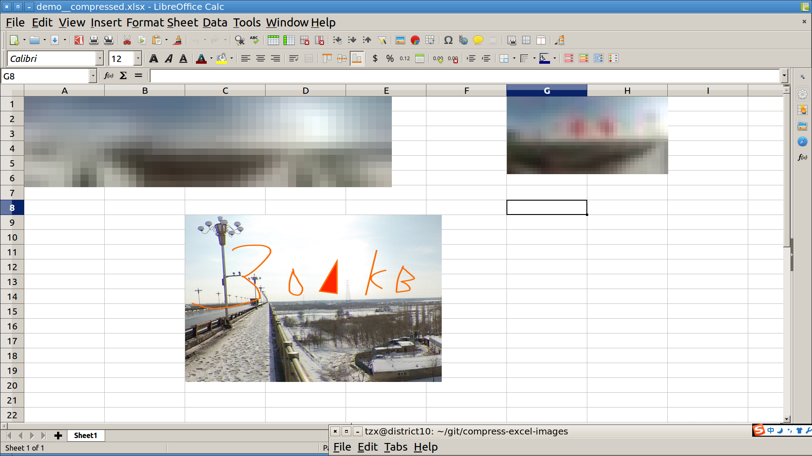

# Compress XLSX Image files

把 Excel 里太大的图片 (文件大小) 通过降低分辨率和尺寸的方式减少尺寸.

```shell
$ source comprezer.sh
$ IMGSIZE=1,000,000; comprezer demo.xlsx output.xlsx
all image files inside demo.xlsx will be compressed so its filesize less than 1000000 bytes
processing xl/media/image3.jpeg... ...done (image reduced by 537606 bytes =  1358165 -   820559)
reduced
    /Users/zxtang/git/compress-excel-images/demo.xlsx ( 2106274 bytes) to
    output.xlsx ( 1543716 bytes) by
     562558 bytes
```

Before:


After:


